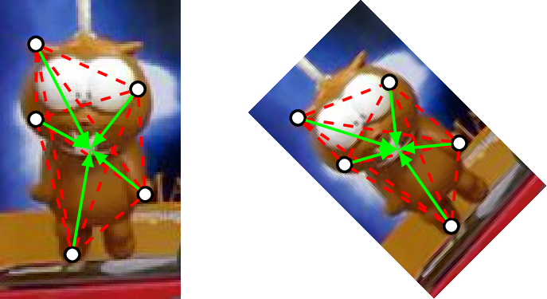
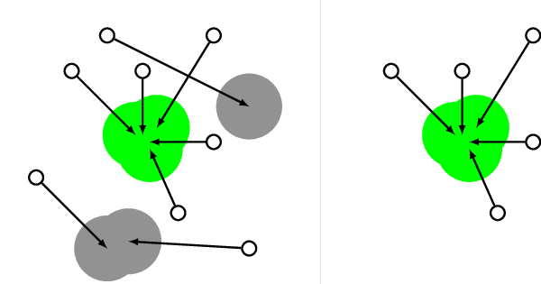

Consensus-based Matching and Tracking of Keypoints (CMT) is an award-winning object tracking algorithm, initially published at the [Winter Conference on Applications of Computer Vision 2014](http://www.wacv14.org),
where it received the Best Paper Award.
CMT is able to track a wide variety of object classes in a multitude of scenes
without the need of adapting the algorithm to the concrete scenario in any way.
Experiments have shown that CMT is able to achieve excellent results
on a dataset that is as large as 60 sequences.
Our Python implementation is freely available under the BSD license, meaning that you can basically do with the code whatever you want.

## How does it work?
The main idea behind CMT is to break down the object of interest into tiny parts, known as keypoints.
In each frame, we try to again find the keypoints that were already there
in the initial selection of the object of interest. 
We do this by employing two different kind of methods.
First, we *track* keypoints from the previous frame to the current frame by estimating
what is known as its *optic flow*.
Second, we *match* keypoints globally by comparing their *descriptors*.
As both of these methods are error-prone, we employ a novel way of looking for consensus within
the found keypoints by letting each keypoint vote for the object center,
as shown in the following image:



The votes are then clustered and outliers are removed:



Based on the remaining keypoints, the new bounding box is computed and the process continues.
All the details can be found in [our publication](/publications/wacv_2014/wacv_2014.pdf).

## How to get it?

You can download CMT in either [zip][5] or [tar formats][6].
You can also browse the source code on [GitHub][2] or clone the project directly with [Git][7] by running:

```
$ git clone git://github.com/gnebehay/CMT
```

If you use our algorithm in scientific work, please cite our publication
```
@inproceedings{Nebehay2014WACV,
    author = {Nebehay, Georg and Pflugfelder, Roman},
    booktitle = {Winter Conference on Applications of Computer Vision},
    month = mar,
    publisher = {IEEE},
    title = {Consensus-based Matching and Tracking of Keypoints for Object Tracking},
    year = {2014}
}
```

## Dataset

You can [download the dataset][1] (~1.2GB) that we employed for evaluating our algorithm,
consisting of 60 sequences collected by [Tomas Vojir](http://cmp.felk.cvut.cz/~vojirtom/dataset/index.html).

## Results

The following results were obtained using exactly the same parameter settings.

<iframe width="420" height="315" src="//www.youtube.com/embed/rlOrNkD8bKU" frameborder="0" allowfullscreen></iframe>
<iframe width="420" height="315" src="//www.youtube.com/embed/I6DMa71srjg" frameborder="0" allowfullscreen></iframe>
<iframe width="420" height="315" src="//www.youtube.com/embed/bt4PBw_a2V8" frameborder="0" allowfullscreen></iframe>
<iframe width="420" height="315" src="//www.youtube.com/embed/1OcImAHAgNI" frameborder="0" allowfullscreen></iframe>
<iframe width="420" height="315" src="//www.youtube.com/embed/j-gHRIJrH7Y" frameborder="0" allowfullscreen></iframe>
<iframe width="420" height="315" src="//www.youtube.com/embed/sWEf24h0LtA" frameborder="0" allowfullscreen></iframe>
<iframe width="420" height="315" src="//www.youtube.com/embed/WMwh6vaIer4" frameborder="0" allowfullscreen></iframe>
<iframe width="560" height="315" src="//www.youtube.com/embed/NiKrvvxTG4I" frameborder="0" allowfullscreen></iframe>
<iframe width="420" height="315" src="//www.youtube.com/embed/svrsHQZz7YU" frameborder="0" allowfullscreen></iframe>
<iframe width="420" height="315" src="//www.youtube.com/embed/Vwxp6QDYTlw" frameborder="0" allowfullscreen></iframe>
<iframe width="420" height="315" src="//www.youtube.com/embed/OgB2WGGq05Y" frameborder="0" allowfullscreen></iframe>
<iframe width="420" height="315" src="//www.youtube.com/embed/3_8p84UVnYY" frameborder="0" allowfullscreen></iframe>
<iframe width="420" height="315" src="//www.youtube.com/embed/ajWtq0gfjN4" frameborder="0" allowfullscreen></iframe>
<iframe width="560" height="315" src="//www.youtube.com/embed/VWKcFmn0Lok" frameborder="0" allowfullscreen></iframe>
<iframe width="420" height="315" src="//www.youtube.com/embed/52uGt29JFhw" frameborder="0" allowfullscreen></iframe>
<iframe width="420" height="315" src="//www.youtube.com/embed/2B3xgd2D780" frameborder="0" allowfullscreen></iframe>
<iframe width="420" height="315" src="//www.youtube.com/embed/qqdZ2z38c_Q" frameborder="0" allowfullscreen></iframe>
<iframe width="420" height="315" src="//www.youtube.com/embed/M8j13BH_d7Q" frameborder="0" allowfullscreen></iframe>
<iframe width="420" height="315" src="//www.youtube.com/embed/ibSCGvxl2Xs" frameborder="0" allowfullscreen></iframe>
<iframe width="560" height="315" src="//www.youtube.com/embed/3g39LznCAVQ" frameborder="0" allowfullscreen></iframe>
<iframe width="420" height="315" src="//www.youtube.com/embed/YAtzyGbcVrY" frameborder="0" allowfullscreen></iframe>
<iframe width="420" height="315" src="//www.youtube.com/embed/0xYxtsgMhLQ" frameborder="0" allowfullscreen></iframe>
<iframe width="420" height="315" src="//www.youtube.com/embed/fhr9Ae6WQk8" frameborder="0" allowfullscreen></iframe>
<iframe width="420" height="315" src="//www.youtube.com/embed/8ViYhIxAc0M" frameborder="0" allowfullscreen></iframe>
<iframe width="420" height="315" src="//www.youtube.com/embed/jrahxtkmo1g" frameborder="0" allowfullscreen></iframe>
<iframe width="560" height="315" src="//www.youtube.com/embed/YpxHEHTvGWM" frameborder="0" allowfullscreen></iframe>

[1]: https://www.dropbox.com/s/oogyagnrrsi9n49/cmt_dataset.7z?dl=0
[2]: https://github.com/gnebehay/CMT 
[5]: https://github.com/gnebehay/CMT/zipball/master
[6]: https://github.com/gnebehay/CMT/tarball/master
[7]: http://git-scm.com
