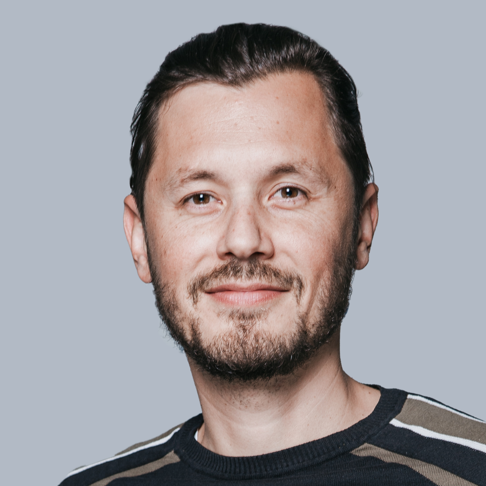

  

I am a PhD student at the Safety and Security Department of the Austrian Institute of Technology,
where I am working together with [Roman Pflugfelder][1].
My PhD supervisor is [Horst Bischof][2] from the Institute for Computer Graphics and Vision
at the Graz University of Technology.

My research interests are novel computer vision algorithms for object tracking.
I am specifically interested in developing methods that are applicable to a wide range of object classes and scenarios
while not requiring any manual adaptation or re-training (model-free object tracking).

On this page you can find a [C++ implementation of OpenTLD](/tld),
a tracking algorithm that sparked [quite some interest in popular media][3]
as well as a list of all my [publications](/publications).
I also maintain a [blog](/blog).

#Breaking News

Our paper [Consensus-based Matching and Tracking of Keypoints for Object Tracking](/cmt) was awarded the Best Paper Award at the Winter Conference on Applications of Computer Vision 2014.
[1]: http://www.cat-project.at/index.php/team/roman-pflugfelder
[2]: http://www.icg.tugraz.at/Members/bischof
[3]: http://www.engadget.com/2011/03/31/zdenek-kalals-object-tracking-algorithm-learns-on-the-fly-like
